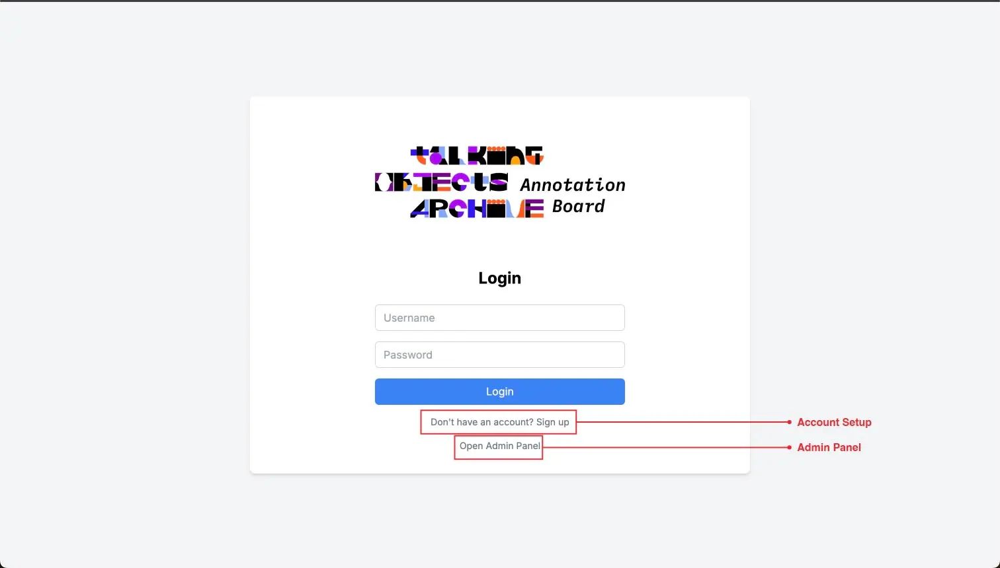
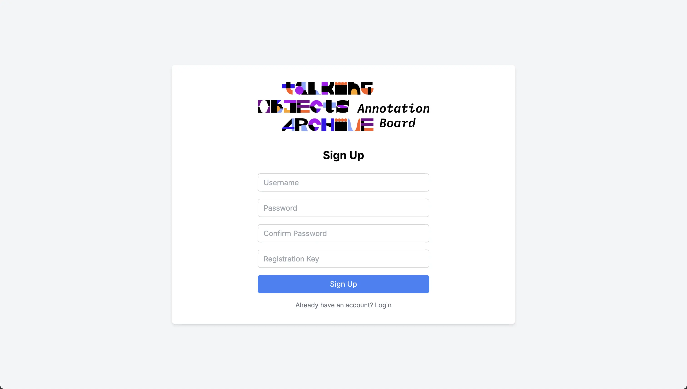
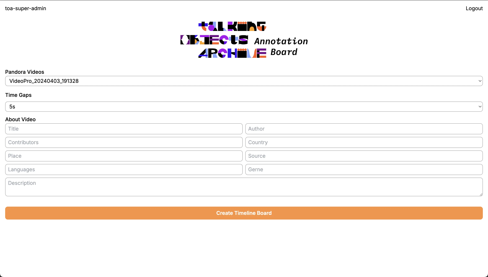
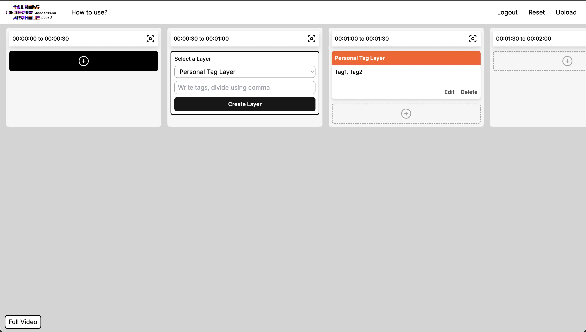
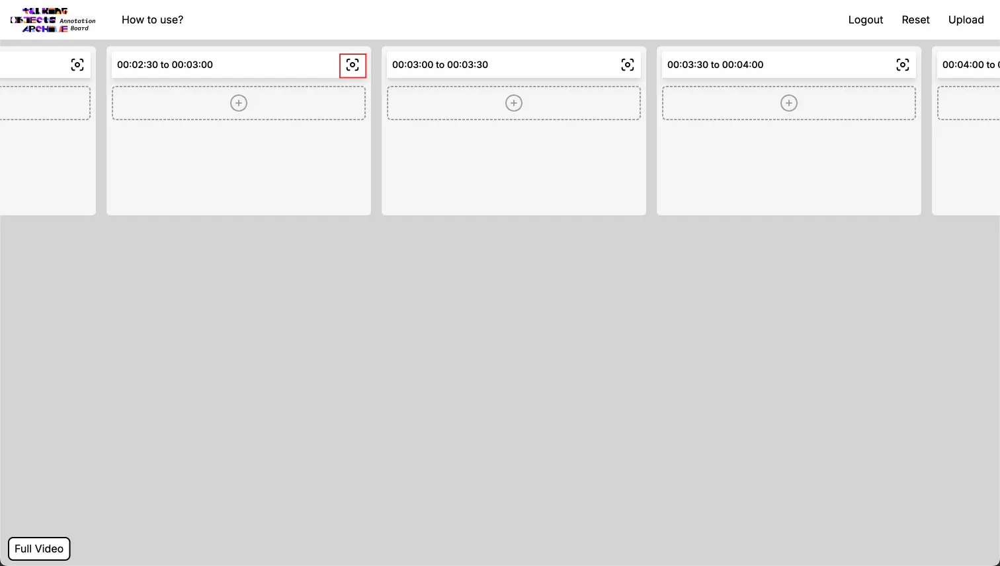
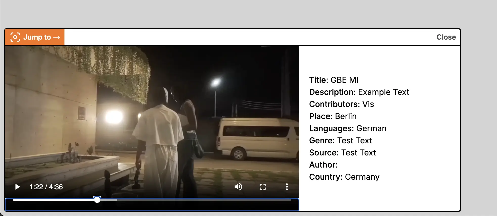

# Annotation Board User Guide

## Table of Contents
1. [Getting Started](#getting-started)
   - [Account Setup](#account-setup)
   - [Login](#login)
   - [Accessing the Board](#accessing-the-board)
2. [Annotation Types](#annotation-types)
   - [Categories](#categories)
   - [Places](#places)
   - [Events](#events)
   - [References](#references)
   - [Data](#data)
   - [Tags](#tags)
3. [Workflow](#workflow)
   - [Uploading Videos](#uploading-videos)
   - [Creating Annotations](#creating-annotations)
4. [Tips & Best Practices](#tips--best-practices)
   - [Keyboard Shortcuts](#keyboard-shortcuts)
   - [Common Issues](#common-issues)

## Getting Started
[link](https://board.talkingobjectsarchive.org)

## Account Setup
- Create an account on the annotation board website
- A secret key is required for account creation
- Contact the TalkingObject Team to obtain the secret key

## Login
- Visit the annotation board website
- Enter your username and password
- Click the login button to access your account

## Accessing the Board & Meta Data of a Video
- After logging in, you'll see the main dashboard
- The dashboard displays your available videos
- Write the meta data of video you want to work

#### __Meta data__
- Pandora Videos: List of available videos in your dashboard for annotation
- Time Gaps: Divides the video into time segments, allowing users to create annotation boards for each specific time period
- Title: Name or title of the video
- Contributors: People who participated in the video production
- Author: Main creator or director of the video
- Place: Location where the video was recorded
- Languages: Available language options for the video
- Source: Original source or provider of the video content
- Country: Country of origin or production
- Genre: Category or type of video content
- Description: Brief summary or overview of the video content

## Creating Your Annotation Board
- Click "+" button to add a new annotation
- Select a Layer for your annotation type
- Write text content for the selected layer

## Jump To Specific Time
- Click the "Jump to" button in the timeline
- Video will start playing from the selected timestamp

- Alternatively, click the "Jump to" button in the video player
- This will take you to the annotation board for the current timestamp

## Uploading Annotations
- Click the "Upload" button to save and share your annotations

